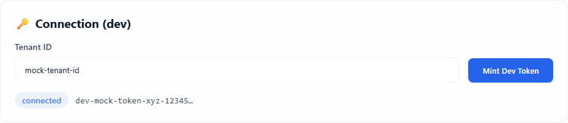
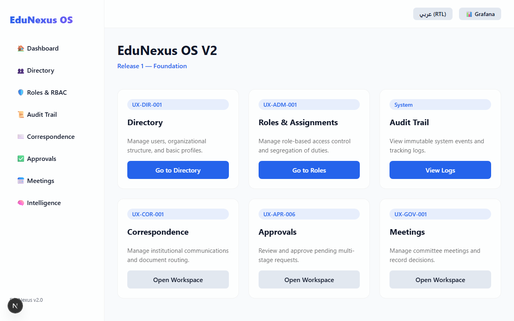
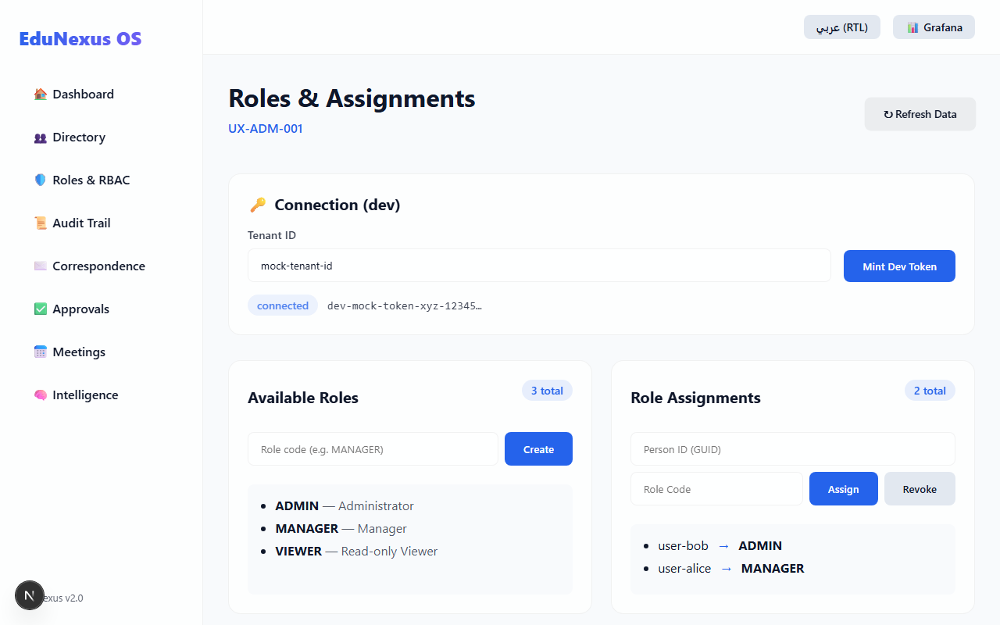

# EduNexus OS V2 - User Guide

## Table of Contents
1. [Introduction](#introduction)
2. [Initial Setup & Authentication](#initial-setup--authentication)
3. [Navigating the Dashboard](#navigating-the-dashboard)
4. [Roles & Assignments](#roles--assignments)
5. [Troubleshooting & FAQ](#troubleshooting--faq)

---

## 1. Introduction

Welcome to **EduNexus OS V2**, the premier operating system for educational institution management. This guide is designed for administrators and staff members who need to manage users, assign roles, track audit logs, and oversee governance processes.

---

## 2. Initial Setup & Authentication

Before you can manage roles and users, you must authenticate your session by minting a Dev Token linked to your Tenant ID. 

### Steps:
1. Navigate to the **Roles & RBAC** page using the left sidebar.
2. Under the **Connection (dev)** section, locate the **Tenant ID** input field.
3. Enter your assigned Tenant ID (e.g., `mock-tenant-id`).
4. Click the **Mint Dev Token** button. 
5. You should see a green "connected" badge appear alongside your secure token hash.

> *Highlight: The ConnectionBar validates your active session before communicating with the backend APIs.*

---

## 3. Navigating the Dashboard

The EduNexus Dashboard is your central hub. From here, you have quick access to all vital modules of the OS.

- **Directory:** Manage users, organizational structure, and basic profiles.
- **Roles & Assignments:** Manage role-based access control and segregation of duties.
- **Audit Trail:** View immutable system events and tracking logs.
- **Correspondence & Approvals:** Manage communications and pending multi-stage requests.

---

## 4. Roles & Assignments

The Roles module is the most critical area for Security Administrators. It allows you to create access roles and bind them to specific users.

### Creating a New Role
1. On the left side under **Available Roles**, enter a clear, capitalized role code (e.g., `MANAGER`).
2. Click **Create**. The role will immediately appear in the list below.

### Assigning a Role to a User
1. On the right side under **Role Assignments**, enter the **Person ID** (e.g., `user-bob`).
2. Enter the **Role Code** (e.g., `ADMIN`) in the adjacent box.
3. Click **Assign**. The system enforces Separation of Duties (SoD) automatically on the server side to ensure compliance.
4. To remove access, input the same details and click **Revoke**.

---

## 5. Troubleshooting & FAQ

**Q: Why does the "Refresh Data" button show a red connection error?**
A: Ensure you have minted your Dev Token first. If you have, verify that the `.NET` backend services are currently running.

**Q: I want to switch the interface to Arabic (RTL). How do I do that?**
A: In the top right corner of the application header, click the button labeled `عربي (RTL)`. The entire layout, including the sidebar and text alignments, will automatically flip to support Right-to-Left formatting. Click it again to switch back to English.

**Q: How do I access detailed Analytics?**
A: Click the **📊 Grafana** button in the top right navigation bar. This will open your dedicated metrics and observability dashboards in a new tab.

---
*EduNexus OS V2 — Release 1*
